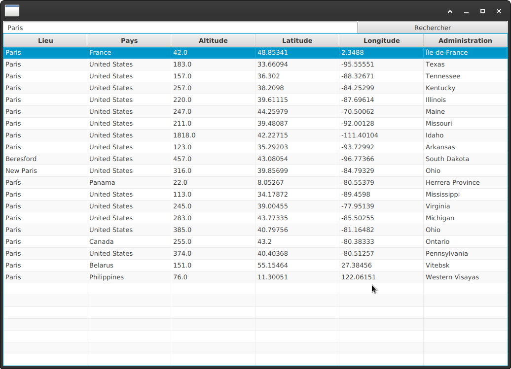

# WeatherReport

## Introduction

WeatherReport est un programme client écrit en Java avec JavaFX permettant de consulter la météo du monde entier via l'API open-meteo https://open-meteo.com/.

## Utilisation

Recherche d'un lieu par mot clef 

- Saisir un nom de ville dans la zone de recherche puis cliquer sur le bouton "rechercher".

Afficher la météo du jour heure par heure

- Double clic sur un lieu dans le tableau

Présentation des résultats :

- Tableau 

- Séléctionner la courbe souhaitée dans la liste déroulante.

